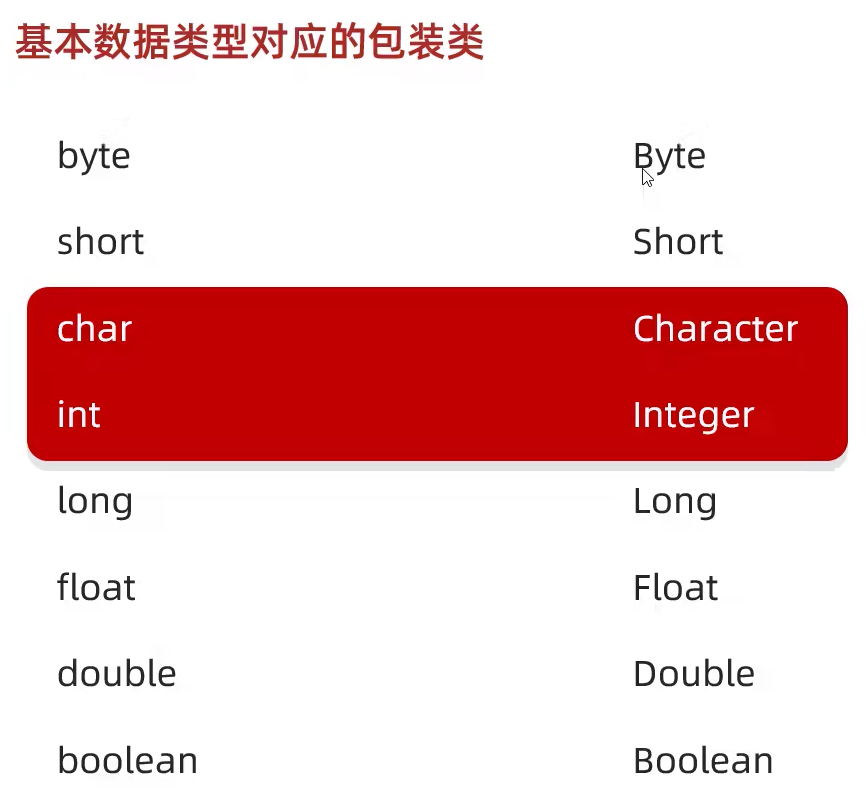

# JAVA

## 重载

方法名相同，参数类型或个数不同。

## String类 
这两个类效率高，必用！
StringBuilder用来拼接，反转(append(),reverse()) 
StringJoiner用来加分隔符和前后缀(add())
修改字符串的两种方式，用subString方法，或者转成字符数组，
字符串转字符数组
```
char[] arr = str.toCharArray(); 
String result = new String(arr);
```
整数转字符串
```
int num = 123242332;
String str = String.valueOf(num);
String str = Integer.toString(num);
String str = num.toString();
```
字符串转整数(int是基本数据类型，Integer是int的包装类，需要实例化)
```
String str = '12423432532';
Integer num = Integer.valueOf(str);
int num = Integer.parseInt(str);
```

## ArrayList集合
数组和集合区别
长度：数组的长度是固定的，集合的长度可变，集合自动扩容。
存储类型：集合存储引用数据类型，集合不能直接存基本数据类型，需要存储基本数据类型的包装类。
 ```
 ArrayList<String> alist = new ArrayList<String>();  //可以
 ArrayList<String> alist = new ArrayList<>();        //JDK 7以后 右边String不用加
 ArrayList<int> alist = new ArrayList(); //报错
 ```


## IDEA快捷键
ctrl + alt + l 自动设置好格式
ctrl + alt + m 自动把圈中代码生成方法
shift + f6 把变量用到的地方同时修改名字
数组名。fori可以自动生成数组遍历循环, string名。length。fori自动生成字符串遍历, forr是倒着遍历
psvm 生成默认main方法
alt + insert生成构造方法
setting plugin安装ptg插件可以自动生成构造方法
ctrl + p显示方法参数
ctrl + b 或 ctrl + 鼠标左键 追溯方法源码
ctrl + alt + v 自动生成左边代码
ctrl + n 搜索
ctrl + F12 列出当前打开文件里所有方法


